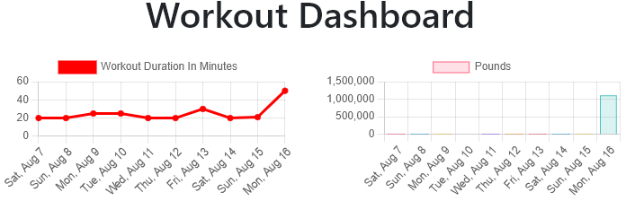

# Workout Tracker

Deployed <a href="https://njt-fitness-tracker.herokuapp.com/">here</a>.

## Table of Contents

- [Instructions](#instructions)
- [Questions](#questions)
- [License](#license)

## Description:

The purpose of this web application is to allow a user to create, view, and track workouts.

## Instructions

1. Follow this <a href="https://njt-fitness-tracker.herokuapp.com/">link</a> to navigate to the web application.

    

2. Click on the `New Workout` button to create a new workout.
3. When you click on the `New Workout` button you will need to choose from either a Resistance or Cardio exercise type.
4. You then input the following information depending on which choice you selected:
    * Resistance
        * Exercise Name
        * Weight (lbs)
        * Sets
        * Reps
        * Duration (minutes)

        

    * Cardio
        * Name
        * Distance(miles)
        * Duration 

        

5. Clicking on the `Fitness Tracker` button will navigate you back to the landing page.
6. Clicking on the `Dashboard` button will navigate you to the dashboard where you can view total workout times and weights lifted.

    

## Quesions

If you have any questions, contact me <a href="https://github.com/TheHebi" target="_blank">here</a>, or send me an email at nturcotte8@live.com.

## License

This project uses the MIT License
